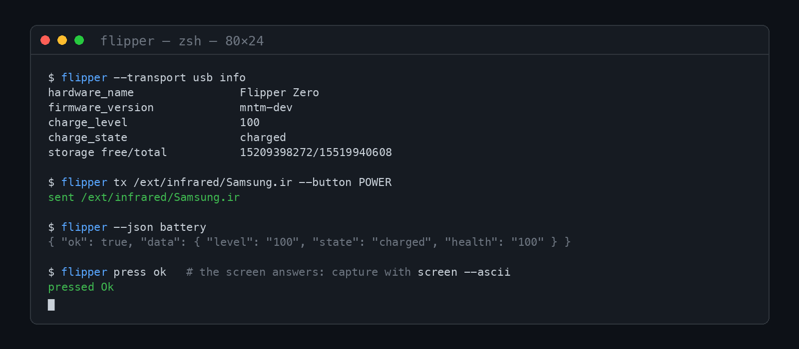

<p align="center">
  
</p>

<p align="center">
  <a href="https://github.com/flipper-hero/cli/actions/workflows/ci.yml"></a>
  
  
  <a href="LICENSE"></a>
</p>

<p align="center">
  <b>flipper</b> — your Flipper Zero over USB and Bluetooth LE from one binary,<br>
  with machine-readable output so AI agents can drive it and humans can read it.
</p>
<p align="center">
  <a href="#features">Features</a> ·
  <a href="#for-agents">For agents</a> ·
  <a href="#transports">Transports</a> ·
  <a href="#getting-started">Getting started</a> ·
  <a href="#development">Development</a>
</p>

---

One command reads your SD card, sends a signal, emulates a badge, captures the
screen or reaches the device's entire protobuf surface. Every command prints
human text by default and exactly one JSON document with `--json`, so scripts,
agents and people share the same surface.

Pair it with [**FlipperHero for iOS**](https://github.com/flipper-hero/ios-app):
the phone app gives your Flipper an AI agent with approvals and an audit log;
the CLI gives your terminal — and your local agents — the same device over USB
and Bluetooth.

## Features

<table>
<tr>
<td width="50%" valign="top">

### 🖥️ Two transports, one protocol

USB CDC (macOS, Linux, Windows, **FreeBSD**, no pairing, plug and play) and
Bluetooth LE (macOS, Linux, Windows, with the firmware's flow-control credits
and on-demand pairing on Linux). `--transport auto` picks what is there.

</td>
<td width="50%" valign="top">

### 🤖 Built for agents

`--json` prints exactly one document on stdout, progress and hints go to
stderr, exit codes are stable (0 ok, 1 failed, 3 not found). `flipper raw`
exposes the device's whole protobuf surface as JSON, so anything without a
subcommand is still one command away.

</td>
</tr>
<tr>
<td valign="top">

### 📟 The whole device

Storage up and down with integrity you can verify, apps started and stopped,
signals transmitted, cards emulated, the 128×64 display captured as PNG or
ASCII, buttons pressed, GPIO pins driven, firmware updates staged.

</td>
<td valign="top">

### 🛡️ Predictable where it matters

`bad-usb load` never starts a script — the operator presses Run. Destructive
commands do exactly what they say and nothing else. Firmware-build quirks
(external-FAP builds, app session binding) surface as clear errors, not hex
statuses.

</td>
</tr>
</table>

## For agents

Add the bundled skill to your agent (Claude Code, Cursor, …):

```sh
cp -r skills/flipper ~/.claude/skills/flipper
```

`skills/flipper/SKILL.md` teaches it the command map, the JSON contract, the
exit codes and the workflows that work well (screen + press closed loops,
storage walks, raw protobuf). The CLI itself is a low-level tool and does what
it is told: risk assessment, approvals and audit logs live in the FlipperHero
iOS app's agent layer.

## Transports

| | USB (`--transport usb`) | Bluetooth LE (`--transport ble`) |
|---|---|---|
| Platforms | macOS, Linux, Windows, FreeBSD | macOS, Linux, Windows |
| Setup | plug in | pair once, then connect |
| Pairing | none | macOS: automatic dialog; Linux: this CLI pairs over D-Bus (confirm the code on the Flipper); Windows: pair once in Settings |

`--transport auto` (the default) uses USB when a Flipper port exists and falls
back to Bluetooth. The RPC layer is identical on both links; the Bluetooth
transport additionally implements the firmware's flow-control credits. A
connect that fails once is retried immediately, because the previous CLI
process sometimes still holds the port for a moment.

On macOS the first Bluetooth use asks for terminal Bluetooth permission
(System Settings > Privacy & Security > Bluetooth); `flipper scan` fails with
a hint instead of hanging when that has not happened yet.

Device behaviors worth knowing:

- **`bad-usb load` over USB ends your connection.** The Bad KB app switches
  the device's USB port to keyboard mode, so the CLI's own link disappears.
  The CLI warns before loading and treats the drop as the expected outcome;
  exit the app on the device (Back) to get the serial port back. Over BLE the
  link survives.
- **An RPC-started app belongs to the session that started it.** `app exit`
  from a later `flipper` invocation cannot close another invocation's app
  (the firmware answers APP_NOT_RUNNING) — exit it on the device, or use
  `tx`/`emulate`, which start and stop their app within the same connection.
- **`gpio read` needs input mode first.** The firmware answers
  `ERROR_GPIO_MODE_INCORRECT` for pins nobody configured; the CLI turns that
  into a hint. Use `gpio set <pin> --input [--pull up|down|none]`, or
  `--output` explicitly.
- **Loader names are firmware-dependent.** `tx`/`emulate` start apps by
  loader name (`Sub-GHz`, `NFC`, …). Compiled-in apps are always known;
  firmware builds that ship the main apps as external FAPs may reject some
  names, and the CLI surfaces that as a clear error.

## Commands

```
flipper scan [--duration S]        find Flippers over Bluetooth
flipper ports                      list USB serial ports that look like a Flipper
flipper info                       device, power and storage facts
flipper battery                    level, state, health
flipper ls [PATH]                  list a directory (default /ext)
flipper stat PATH                  one entry
flipper cat PATH                   print bytes to stdout (base64 with --json)
flipper get PATH [OUT]             download
flipper put LOCAL [PATH]           upload (progress on stderr)
flipper mkdir PATH                 create directory, parents included
flipper rm [--recursive] PATH      delete
flipper mv FROM TO                 rename or move
flipper tx FILE [--button B]       send a .sub or .ir signal once
flipper emulate FILE               emulate .nfc/.rfid/.ibtn until Ctrl-C or --duration
flipper bad-usb load FILE          load a script (the operator presses Run)
flipper app start NAME [ARGS]      start an app by loader name; app exit; app error
flipper screen [OUT.png|--ascii]   capture the 128x64 display
flipper press KEY [--long]         up, down, left, right, ok, back
flipper alert                      beep, blink, vibrate
flipper reboot [--updater]         restart
flipper update MANIFEST            stage an update package, reboot into the updater
flipper raw '{"content":{...}}'    raw protobuf RPC as JSON (proto3 mapping)
flipper gpio set|read|write PIN    header pins
```

Global flags: `--json`, `--transport auto|usb|ble`, `--device ID` (Bluetooth id
or name from `scan`), `--port PATH` (USB device path), `--timeout SECONDS`.

## Getting started

**You need** Rust 1.85+ and a Flipper Zero. No protobuf compiler: the
generated bindings are committed.

```sh
git clone https://github.com/flipper-hero/cli.git
cd cli
cargo install --path crates/flipper-cli
flipper info
```

`--transport auto` finds the device over USB; add `--device <id from scan>`
for Bluetooth.

## Development

```sh
cargo test          # framing, RPC client, device API against a simulated Flipper: no hardware, no network
cargo clippy --all-targets
cargo run -p genproto            # regenerate protobuf bindings (needs protoc)
cargo run -p flipper-usb --example probe -- /dev/cu.usbmodem…    # raw serial debugging aid
```

Tests use a simulated Flipper that answers real protobuf messages over an
in-memory pipe, mirroring the iOS app's test conventions: response matching,
chunked transfers, error statuses, timeouts, the transmit press/hold/release
sequence, screen capture, raw JSON. The simulated storage enforces FAT
semantics (mkdir needs a parent), so path-handling bugs cannot hide.

### Hardware test suite

Against a real Flipper attached over USB:

```sh
cargo test -p flipper-cli --test hardware -- --ignored --test-threads=1
```

Twelve tests exercise the live device: ping, info, storage, a 200 KB
multi-chunk round trip with content hashing, empty-file round trip, rename,
the app start/exit handshake, NFC emulation, screen capture, a closed-loop
press test (OK must visibly change the screen, Back must close it), a GPIO
cycle, raw JSON, and the update-rejection path. Everything writes only under
`/ext/.flipper-test` and cleans up; tests serialize on the port so they are
order-independent. Deliberately excluded: Sub-GHz transmission (real RF) and
`bad-usb load` (cuts the USB link the suite runs on). Set `FLIPPER_TEST_PORT`
to pin a specific serial device.

Layout:

| Path | What |
|---|---|
| `crates/flipper-core` | framing, RPC client, device API, screen rendering, raw JSON — transport-agnostic |
| `crates/flipper-usb` | CDC-ACM serial transport (0483:5740), `start_rpc_session` dance |
| `crates/flipper-ble` | btleplug transport, flow-control credits, BlueZ pairing shim for Linux |
| `crates/flipper-cli` | the `flipper` binary |
| `crates/genproto` | regenerates `flipper-core/src/pb` from `protos/` |
| `skills/flipper` | agent skill: how to drive the CLI, for Claude Code and friends |
| `protos/` | vendored from [flipperzero-protobuf](https://github.com/flipperdevices/flipperzero-protobuf), see `protos/PROVENANCE.md` |

## Credits and legal

The protocol knowledge came from the FlipperHero iOS app, the
[flipperdevices/Flipper-iOS-App](https://github.com/flipperdevices/Flipper-iOS-App)
protocol reference and the Momentum firmware sources. Use this with your own
devices and systems you are allowed to test; what the Flipper may transmit is
governed by its firmware and your local regulations.

Flipper Zero is a trademark of Flipper Devices Inc. This project is not
affiliated with them. MIT licensed, see [LICENSE](LICENSE).
